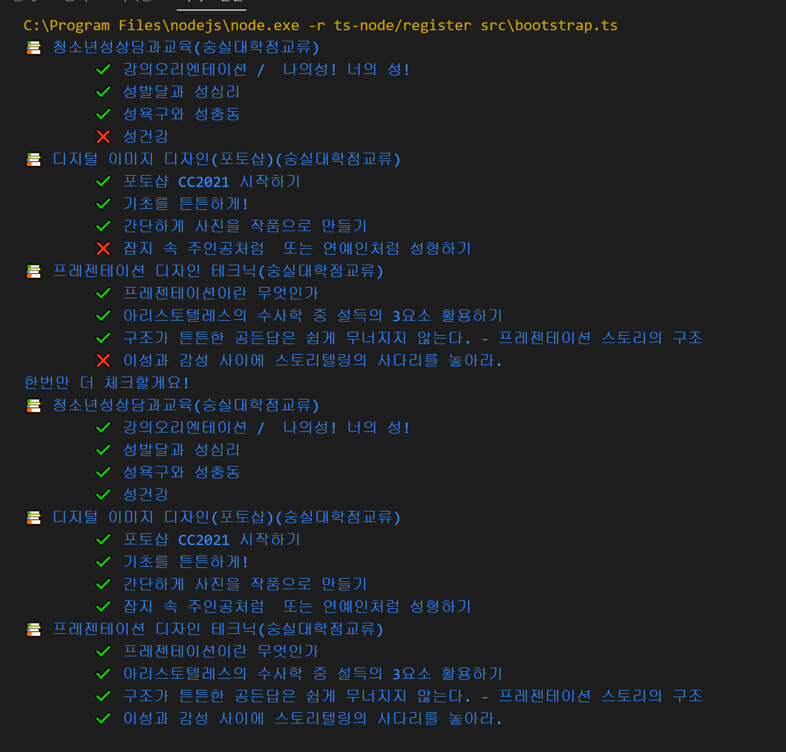

# 숭실사이버대 온라인 강의 손가락 까닥 안하고 이어 듣기

매번 강의 끝날때마다 마우스 움직이는게 귀찮아서 만들었습니다. 절대 밤에 틀어놓고 잘려고 하는 목적이 아니니 오해는 삼가 해주세요 ^^~

## 설치

먼저 숭실사이버대는 [안전하고 강력한 웹플레이어](https://www.axissoft.co.kr/solution_test_starplayer.php)를 설치하지 않으면 볼 수 없기 때문에 설치해줍니다. 해당 다운로드 페이지에서 테스트 영상이 제대로 나오는지 확인해주세요.

```env
# your id of https://www.kcu.ac/login/login.asp?loginType=05
KCU_ID=숭실사이버대학번
# your password of https://www.kcu.ac/login/login.asp?loginType=05
KCU_PASSWORD=숭실사이버대비밀번호
# using headless = 1
HEADLESS=0
# your browser path
EXECUTABLE_BROWSER_PATH=C:\Program Files (x86)\Google\Chrome\Application\chrome.exe
```

`.env.example` 파일을 `.env` 파일로 복사해서 값을 채워넣어주세요.
`EXECUTABLE_BROWSER_PATH`값이 뭐냐면 [정말 안전하고 강력한 웹플레이어👎](https://www.axissoft.co.kr/solution_test_starplayer.php)는 일반적인 브라우저에서만 재생되기 때문에, 웹플레이어를 실제로 설치하고 실행했던 브라우저 경로를 넣습니다. 예제에서는 윈도우 환경에서의 크롬 경로입니다.

```bash
git clone https://github.com/minuukang/kcu-online-lecture-autoplay
cd kcu-online-lecture-autoplay
npm i
npm start
```



이제 재생을 순차적으로 진행합니다. 해당 사이트 강의체크가 간헐적으로 완료 처리가 되지 않는 경우가 많기에, 실행 후 강의를 모두 들었다는 것을 재확인 후 프로그램이 종료됩니다.

(있을지 모르겠지만!) 동영상 재생을 백그라운드에서 하고 싶다면 `.env` 에서 `HEADLESS` 옵션을 "1" 로 채워놓으세요. 브라우저를 headless로 전환합니다.
